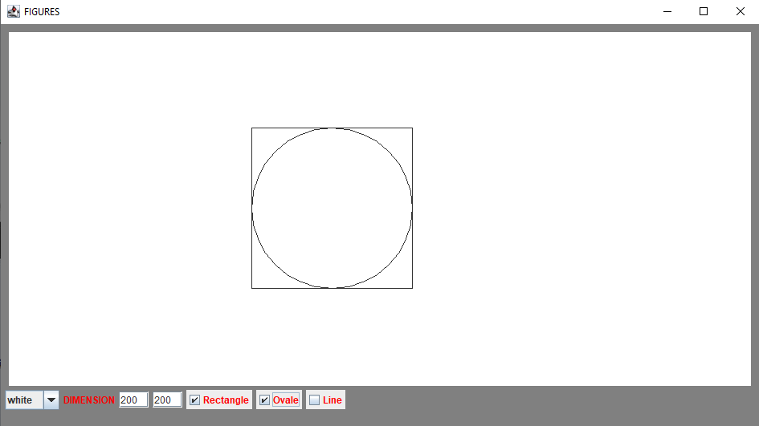

# AppFigures
this is a simple java project that let you draw figures in a panel by choosing a shape and a dimension.

## Download and Run
**Windows**
- you can download the project file and run the jar file in your command line 

**Run**

``java -jar AppFigures.jar``

- or you can download the source project and execute the script to compile and run the application

``start script.cmd``

**Linux**
- open your terminal in your download location and run the script to compile and run the application

``./run.sh``

## Enjoy! :grin: